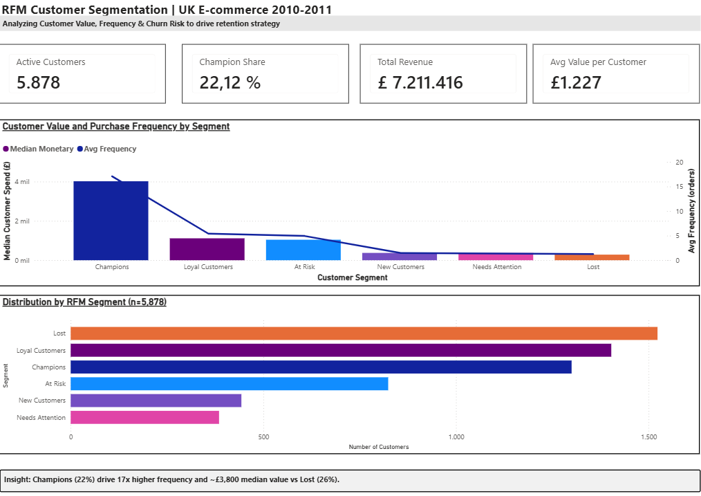
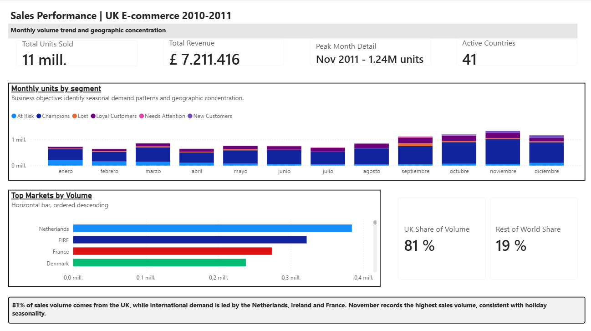
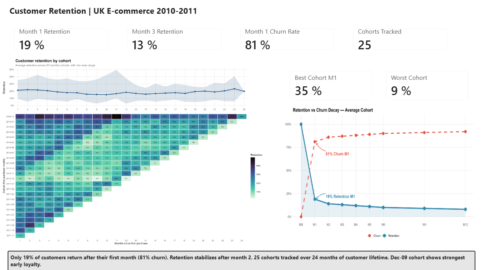

# E-commerce Sales & Customer Analytics
### A BI Consulting Engagement — RFM Segmentation, Sales Diagnostics & Retention Audit

<p align="left">


</p>

---

## Engagement Overview

A retail client needs three questions answered before they can act: **where is revenue concentrated, which customers are worth protecting, and where does retention break down.** This project answers all three, using 1.07M real transactions from a UK-based online retailer (Dec 2009 – Dec 2011), through a full pipeline of Python data engineering, R statistical validation, and an executive Power BI dashboard.

This is not an exploratory notebook. It is structured, documented, and validated the way a BI consultancy would deliver it to a client — every finding below is backed by a statistical test, not a visual impression.

---

## Key Business Findings

| Metric | Value |
|---|---|
| Active customers analyzed | 5,878 |
| Total revenue | £7,211,416 |
| Total units sold | 11M |
| Champion segment share | 22.12% of customers |
| Avg. revenue per customer | £1,227 |
| Month-1 customer retention | 19% (81% churn) |
| Month-3 customer retention | 13% |
| UK share of sales volume | 81% |
| Peak sales month | November 2011 — 1.24M units |
| Cohorts tracked | 25 monthly cohorts, 24-month window |

**The headline insight:** Champions — 22% of the customer base — drive 17x higher purchase frequency and a ~£3,800 higher median spend than the Lost segment, which alone represents 26% of customers. At the same time, 81% of customers churn after their very first month. **The single highest-leverage lever in this business is not acquisition — it's the first 30 days after a customer's first purchase.**

---

## Dashboard

Three-page executive Power BI dashboard — segmentation, sales performance, and retention — built to consulting-deliverable standard: KPI cards, statistically validated insights, and a closing recommendation on every page.

### Page 1 — Customer Segmentation


RFM (Recency, Frequency, Monetary) segmentation splitting the customer base into six actionable segments. Combo chart isolates purchase frequency from spend so high-value outliers (Champions) don't visually flatten the other five segments — a deliberate fix over a naive scatter plot.

### Page 2 — Sales Performance


Monthly volume trend by segment and geographic concentration. UK excluded from the market-comparison chart by design — at 81% of volume, including it renders every other market illegible.

### Page 3 — Customer Retention


Custom cohort retention heatmap (built in R/ggplot2, not a default library chart) paired with a churn-decay curve that visualizes the 81% first-month churn cliff directly against the 19% retention line.

---

## Methodology

### 1. Data Preparation — Python (`notebooks/01_data_preparation.ipynb`)
Loaded and merged both sheets of the raw dataset, standardized column names across source variants, removed cancelled orders and unattributable transactions (missing Customer ID), computed line-level revenue. **806K clean transaction rows** retained for analysis.

### 2. RFM Segmentation — Python (`notebooks/02_rfm_segmentation.ipynb`)
Quintile-scored every customer on Recency, Frequency, and Monetary value, then mapped scores to six named, business-actionable segments: Champions, Loyal Customers, New Customers, At Risk, Needs Attention, Lost.

### 3. Cohort Retention Analysis — Python (`notebooks/03_cohort_analysis.ipynb`)
Tracked 25 monthly acquisition cohorts across a 24-month retention window. Cohort table feeds both the Power BI Retention page and a custom R/ggplot2 visualization (see below).

### 4. Statistical Validation — R (`r/04_statistical_validation.R`)
No finding in this project is presented on visual impression alone:

| Test | Result | Conclusion |
|---|---|---|
| ANOVA — Monetary value by RFM Segment | **p = 3.18 × 10⁻⁶⁸** | Segment differences in spend are real, not noise |
| ANOVA — Revenue by calendar month | **p = 1.43 × 10⁻⁸** | November seasonality is statistically significant |
| Customer Lifetime Value (heuristic, 3-yr horizon) | **Median £1,334.67** | Documented assumption, not a black-box model |

### 5. Business Intelligence — Power BI
Three-page executive dashboard with DAX-driven KPIs, statistically consistent color encoding across pages, and a closing insight callout on every page — no page ships without a written takeaway.

---

## Tech Stack

| Layer | Tools |
|---|---|
| Data cleaning & feature engineering | Python — `pandas`, `openpyxl` |
| Statistical validation | R — `stats`, `dplyr`, `aov()`, `TukeyHSD()` |
| Custom visualization | R — `ggplot2`, `patchwork`, `viridis` |
| Business intelligence | Power BI — DAX, custom visuals |
| Version control | Git / GitHub |

---

## Repository Structure

```
ecommerce-sales-customer-analytics/
├── data/
│   ├── raw/                  ← place online_retail_ii.xlsx here (see below)
│   └── processed/            ← cleaned outputs (generated by notebooks/R)
├── notebooks/
│   ├── 01_data_preparation.ipynb
│   ├── 02_rfm_segmentation.ipynb
│   └── 03_cohort_analysis.ipynb
├── r/
│   └── 04_statistical_validation.R
├── powerbi/
│   └── RFM_Dashboard_Antonio.pbix
├── report/
│   ├── executive_summary.pdf
│   └── screenshots/
├── figures/
│   └── cohort_retention_heatmap_pro.png
├── docs/
│   └── technical_documentation.md
├── requirements.txt
├── .gitignore
├── LICENSE
└── README.md
```

---

## How to Reproduce

```bash
git clone https://github.com/FuentesAntro/ecommerce-sales-customer-analytics.git
cd ecommerce-sales-customer-analytics

python -m venv venv
source venv/bin/activate        # Windows: venv\Scripts\activate
pip install -r requirements.txt

# Download the dataset (see Data Source below) → data/raw/online_retail_ii.xlsx

jupyter notebook notebooks/01_data_preparation.ipynb
jupyter notebook notebooks/02_rfm_segmentation.ipynb
jupyter notebook notebooks/03_cohort_analysis.ipynb

cd r && Rscript 04_statistical_validation.R

# Open powerbi/ecommerce_analytics.pbix in Power BI Desktop
```

Full setup, DAX measures, and Power BI build steps documented in [`docs/technical_documentation.md`](docs/technical_documentation.md).

---

## Scope and Limitations

- Public transactional data from a single UK-based online retailer (2009–2011); findings demonstrate methodology, not generalizable market conclusions.
- CLV uses a documented 3-year heuristic, not a probabilistic model (e.g., BG/NBD) — appropriate for a diagnostic audit, not financial forecasting.
- The Dec-2009 cohort shows anomalously high retention (up to 50%) due to small sample size and is treated as a statistical outlier in cohort comparisons, not excluded from the underlying data.

---

## Data Source

Chen, D. (2019). *Online Retail II Dataset.* UCI Machine Learning Repository. https://archive.ics.uci.edu/dataset/502/online+retail+ii

---

## Author

**Antonio Fuentes Moreno**
Data Analyst · Anthropology + Applied Data Science
MSc Applied Data Science for Social Sciences — Universidad de Salamanca (2026–2027)
BA Social and Cultural Anthropology — Universidad de Sevilla
📍 Seville, Spain · [[LinkedIn](https://www.linkedin.com/in/antonio-fuentes-moreno-9a08341a5/)](#) · [GitHub](https://github.com/FuentesAntro)

**License:** MIT
